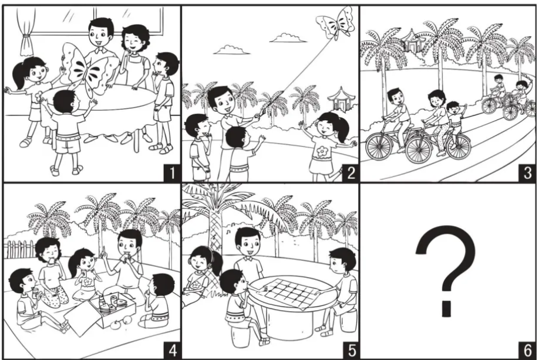

### Chinese is Like Making a Movie  

A picture composition like the one shown below may seem purely inspirational, but it serves a much more fundamental linguistic need: observing a mosaic of related scenes and stitching them into a text with lexical and thematic coherence. This is how the Chinese language works - like a movie that zooms in and out on different frames to complete the narrative. This approach differs fundamentally from English, where the storyline moves more like a twisting, turning roller-coaster.

[Image Source](https://www.ilovereading.sg/products/psle-%E7%9C%8B%E5%9B%BE%E4%BD%9C%E6%96%87%E4%B8%8E%E5%91%BD%E9%A2%98%E4%BD%9C%E6%96%87-psle-guided-compositions-?srsltid=AU7gw4X0SDn8J3aLP2AsJOe45hsShP_-ZQzdJgcg1MQh24HDN9VEy8Sf)

### Main Differences from English

Understanding how Chinese differs from English helps learners master the language much more fluidly. It strengthens cognitive prowess and prevents a major pitfall: trying to understand a movie by closing your eyes and listening only to the soundtrack.

1. **How Time is Handled**  
    Chinese: Scene-Local Aspect - time remains anchored within the frame, and aspect describes how the event unfolds in time **within the frame**, e.g. not yet, ongoing, completed.  
    English: Linear-Global Tense - time marches along an external timeline, and tenses morph the word form to fit the timeline, e.g., go ➔ went ➔ gone.

    > Past: 那天我吃过饭了。 I had already eaten that day.

    > Present: 我刚吃过饭。 I am done with eating.

    > Future: 明天吃过饭我就去机场。 I will eat my meal before going to the airport tomorrow.

2. **How Sentences are Built**  
   Chinese: Topic-Comment - establish the stage first, then present whatever occupies the stage.

   English: Subject-Predicate - lock down the actor and action in a linear sequence, bending it into participial phrases or adverbial clauses as the semantic focus shifts.

    > Actor as topic: 小明冲过终点线了。 Xiaoming crossed the finish line.

    > Action as topic: 冲过终点线，小明赢了。 Crossing the finish line, Xiaoming won. 

3. **How Meaning and Relationships are Carried**  

    Chinese: Lexical encoding, high-context - relational logic is embedded directly into the lexicon; the full semantic value must be mastered, and the user must be well-trained to understand the embedded logic.

    English: Syntactic encoding, low-context - root words are inflected to signal relational logic, and the user picks up the logic from the wordings.

    In the examples below, notice how the character 成 shifts in lexical meaning. This must be learned as a pattern by heart, as the distinction is not marked by syntax:

    > 言之成理 (yán zhī chéng lǐ): To form a reasonable argument; an articulation that pulls words together into a coherent rationale.

    > 万物有成理而不说 (wàn wù yǒu chéng lǐ ér bù shuō): Immutable. The intrinsic principles inherent in all things are never uttered.

4. **How Information is Packed**  
   Chinese: Compact - starts with the bare minimum to convey meaning, adding components only when context demands enrichment or precision.  
   English: Expanded - over-specified and rule-bound, locking down every variable to eliminate ambiguity.

   > 读过了。Minimal: Read / Has read.  
   
   > 他昨天下午读过了。Contextual: He had read it yesterday afternoon.  

   > 他昨天下午认认真真把生物课本第二篇读过了。Maximal: Earnestly and thoroughly, he had read through the second chapter of the biology textbook yesterday afternoon.

5. **How Complex Information is Composed**

    Chinese: Parataxis (hierarchical stacking) - a topic-comment concept is nested within a larger topic-comment concept so details emerge organically within the bigger picture, often omitting link words.

    English: Hypotaxis (linear expansion) - uses dependent clauses, such as which, that, who, and conjunctions to provide mandatory logical interlocks linking details to the macro-narrative.

    过年了，我还在忙，烦死了。 Despite being the New Year | I am still busy with things || and because of that, it frustrates me a lot.

6. **How Punctuation Marks are Treated**  
   Chinese: Governed by rhythm, breath, and visual pacing to frame the scene.  
   English: Tied tightly to formal grammatical parsing and consistent structural rules.

   > 斑马线不过，乱过，还不出事？Not using the zebra crossing and jay-walking instead is bound to cause accident, isn't it?

### How Teaching Should be Approachable

Because Chinese relies on built-in lexical meaning rather than inflection and agreement to construct narratives, traditional grammar drills are largely ineffective. Instead, use these four methods to train students like movie directors:

1. **Topic-Comment Framing:** Training the brain to establish the frame first rather than hunting for a subject-verb-object pipeline.
    >The Sun ☀️ / Rises 🌅
2. **Contextual Cloze (Fill-in-the-Blanks):** Training students to rely on internal lexical logic to deduce the matching comment.
    >The Sun ☀️ / ____
3. **Sequential Picture Narration:** Forcing the learner to construct discourse as a sequence of cinematic scenes rather than a chronological chain.
    >The Sun ☀️ / ____

    >The Cockerel 🐓 / ____
4. **Deconstructing Compound Words:** Interrogating the lexical DNA of compound words to unlock the relatinal meaning of each character - a technique especially useful when reading classical texts like Tang poetry.
    >白日依山尽 黄河入海流 欲穷千里目 更上一层楼

### Moving Beyond Basics

Beyond the basics, learners should focus on grasping historical, social, and immediate contexts, alongside the relational DNA baked directly into the characters. Let the language flow naturally with the right word order, e.g., the position of time words, place words, and auxiliary verbs before the main verb, or the syntax of the 把 and 被 constructions. 

Advanced linguistic analysis, which is what formal grammar truly is, only becomes useful once foundational fluency is achieved. In that sense, grammar serves as a tool for refined mastery rather than a prerequisite for communication.