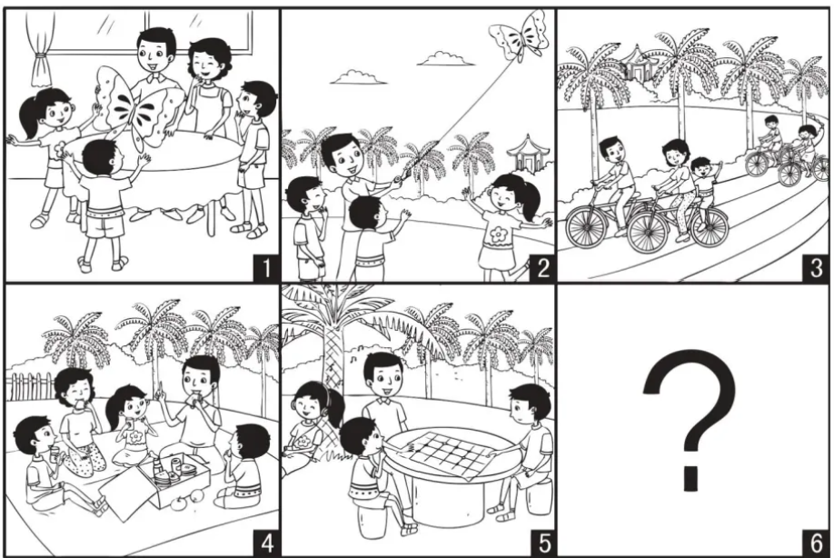

### Chinese is Like Making a Movie  

A picture composition like the one shown below may seem to be inspirational, but it serves a much more fundamental language need, which is to observe a mosaic of related scenes and stitch them into a text with lexical and thematic coherence. This is how the Chinese language works - as a movie that zooms in and out on different scenes. This is fundamentally different from the storyline of English that seems like a moving roller-coaster.

[Image Source](https://www.ilovereading.sg/products/psle-%E7%9C%8B%E5%9B%BE%E4%BD%9C%E6%96%87%E4%B8%8E%E5%91%BD%E9%A2%98%E4%BD%9C%E6%96%87-psle-guided-compositions-?srsltid=AU7gw4X0SDn8J3aLP2AsJOe45hsShP_-ZQzdJgcg1MQh24HDN9VEy8Sf)

### Main Differences with English

1. **How Time is Handled**  
    Chinese: Scene-Local Aspect (time remains anchored within the frame, and aspect describes how the event unfolds in time **within the frame**, e.g. not yet, ongoing, completed).  
    English: Linear-Global Tense (time marches along an external timeline, and tenses change the shape of the word to fit the timeline, e.g., go ➔ went ➔ gone).

    > Past: 那天我吃过饭了。 I had already eaten that day.

    > Present: 我刚吃过饭。 I am done with eating.

    > Future: 明天吃过饭我就去机场。 I will eat my meal before going to the airport tomorrow.

2. **How Sentences are Built**  
   Chinese: Topic-Comment (establish the stage first, then whatever is on the stage).

   English: Subject-Predicate (lock down the actor and action in a line, bending it into participial phrases or adverbial clauses when the semantic focus shifts).

    > Actor as topic: 小明冲过终点线了。 Xiaoming crossed the finish line.

    > Action as topic: 冲过终点线，小明赢了。 Crossing the finish line, Xiaoming won. 

3. **How Meaning and Relationships are Carried**  
   Chinese: Lexical Encoding (relational logic is baked directly into the lexicon; the full semantic must be mastered).  
   English: Syntactic Encoding (the root word is inflected to mean the relational logic).

   In the examples below, see how the word **成** changes its lexical meaning. That has to be learnt as a pattern by heart, as the difference is not shown as syntax.

    > 言之成理 (yán zhī chéng lǐ): To become. An articulation that pulls words together that becomes reasonable.

    > 万物有成理而不说 (wàn wù yǒu chéng lǐ ér bù shuō): Immutable. The intrinsic principles inherent in all things are never uttered.

4. **How Information is Packed**  
   Chinese: Compact (starts with the bare minimum to convey meaning, adding components only as needed to enrich the scope or to increase the precision when the context demands it).  
   English: Expanded (over-specified and rule-bound, locking down every variable to eliminate ambiguity).

   > 读过了。Minimal: Read / Has read.  
   
   > 他昨天下午读过了。Contextual: He had read it yesterday afternoon.  

   > 认认真真，他昨天下午把生物课本第二篇读过了。Maximal: Earnestly and thoroughly, he had read through the second chapter of the biology textbook yesterday afternoon.

### How Teaching Should be Done

Because Chinese relies on semantic and lexical architecture rather than external syntactic scaffolding, traditional Western grammar drills (conjugations, tense charts, case endings) are fundamentally useless.

The four teaching methods below train the cognitive muscles Chinese demands:

1. **Topic-Comment Pacing:** Training the brain to establish the frame first rather than hunting for a subject-verb-object pipeline.
    >(The Sun ☀️ / Rises 🌅)
2. **Contextual Cloze (Fill-in-the-Blanks):** Teaching students to rely on internal lexical logic and collocational boundaries rather than applying a mechanical grammar rule.
    >(The Sun ☀️ / ____)
3. **Sequential Picture Narration:** Forcing the learner to construct discourse as a sequence of cinematic "scenes" rather than a chronological sentence chain.
    >(The Sun ☀️ / ____)

    >(The Cockerel 🐓 / ____)
4. **Deconstructing Compound Words:** Interrogating the lexical DNA of a compound word to unlock its internal relational rules. This is often done when reading classical texts.
    >(成语 vs 成为)

### Moving Beyond Grammar

English is a linear roller-coaster governed by rule-bound mechanics.

Chinese is a cinematic movie built on situational framing and lexical density.

For learners, focus on the fundamentals:

Understand the setting: Grasp the historical, social, and immediate context that frames the scene.

Master the lexicon: Unlock the relational DNA baked directly into the words.

Let the language work naturally without the clunky grammar that most native speakers don't even understand.
